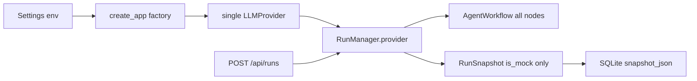

# Run 级 Provider / Model Selection

## A. 当前架构理解（仅与本需求相关）

今天模型选择是**进程级、启动时一次性绑定**，不是 Run 级。

- **配置**：`[backend/config.py](backend/config.py)` 用 `ENABLE_MOCK_LLM`、`LLM_PROVIDER`（`deepseek`|`glm`）、各家 `*_API_KEY` / `*_BASE_URL` / `*_MODEL` 决定行为。Mock 关闭时，启动校验只要求**当前选中**的那一家有 Key 且 model 非空；从不静默回退 Mock。
- **工厂**：`[backend/main.py](backend/main.py)` 的 `create_app()` 构造**单一** `LLMProvider`：`enable_mock_llm` → `MockLLMProvider`（E2E 则为 `ScenarioMockLLMProvider`）；否则按 `llm_provider` 构造 `OpenAICompatibleLLMProvider`（DeepSeek 与 GLM 共用适配器，差异只在注入的 name/key/url/model）。该实例交给 `[RunManager](backend/run_manager.py)`。
- **工作流调用**：`[backend/workflow.py](backend/workflow.py)` 全部走 `self.manager.provider`（`stream_prd` / `generate_review` / `generate_revision_plan` / `repair_structured`）。`run_started` payload 只带 `config.mock`，没有 model id。
- **创建 Run**：`[CreateRunRequest](backend/schemas.py)` 只有 idea、受众、约束、质量门槛、迭代次数。`[RunManager.create_run](backend/run_manager.py)` 把 `is_mock=self.provider.is_mock` 写入快照；费用可用性也按进程级 Provider 计算。
- **快照 / 遥测**：`[PRDRunState](backend/schemas.py)` 有 `is_mock`、`cost_available`、token/timing，**没有** provider/model 字段。`[TelemetryPanel](src/components/TelemetryPanel.tsx)` 只展示 mock 标签与用量，不展示模型名。
- **健康检查**：`GET /api/health` 返回 `{status, mock_mode, provider}`，其中 `provider` 是进程默认（mock 或 `llm_provider`），不是目录。
- **持久化**：`[SQLiteRunStore](backend/run_store.py)` 表结构只有 `run_id` / `snapshot_json` / `updated_at`。整份 `RunSnapshot` 是 JSON 文档；加载走 `RunSnapshot.model_validate_json`。历史兼容靠 **Pydantic 缺省字段**（已有 `current_prd_attempt`、`best_version` 先例），不是 SQL ALTER。
- **前端创建**：`[ProductIdeaForm](src/components/ProductIdeaForm.tsx)` 不选模型；`[src/lib/api.ts](src/lib/api.ts)` 无目录 API。
- **契约**：`[contracts/v1/create_run_request.json](contracts/v1/create_run_request.json)` 与 `[contracts/v1/run_snapshot.json](contracts/v1/run_snapshot.json)` 均无模型字段；`CreateRunRequest` / `RunSnapshot` 均为 `extra="forbid"`。
- **测试注入**：大量测试通过 `create_app(..., provider=MockLLMProvider(...))` 绕过真实工厂；E2E 仍依赖进程级 Mock + Scenario。




---

## B. 影响范围

**新增（小、边界清晰）**

- `[backend/providers/registry.py](backend/providers/registry.py)`（建议名）：从 Settings 构建**安全目录**、解析选择、按 (provider_id, model_id) 取出实例；密钥与 base URL 永不进入公开模型。
- `[backend/tests/test_llm_catalog.py](backend/tests/test_llm_catalog.py)`：目录、解析失败、密钥隔离。
- `[contracts/v1/llm_catalog.json](contracts/v1/llm_catalog.json)`：公开目录样本。

**必须改**

- `[backend/config.py](backend/config.py)`：可选 allowlist（如 `DEEPSEEK_MODELS` / `GLM_MODELS`，缺省等于现有单个 `*_MODEL`）；`LLM_PROVIDER` + 对应 `*_MODEL` 变为**默认选择**。启动仍校验：Mock 关闭时默认 Provider 必须有 Key，不得改选另一家来“救活”启动。
- `[backend/schemas.py](backend/schemas.py)`：公开目录模型；`CreateRunRequest` 增加可选 `provider_id` / `model_id`；`PRDRunState` 增加可选、可安全公开的选择字段。
- `[backend/errors.py](backend/errors.py)`：创建期选择错误（与运行中 `InvalidModelError` 区分）。
- `[backend/main.py](backend/main.py)`：抽出工厂逻辑；`GET /api/llm-catalog`；创建 Run 走 registry；OpenAPI 注册新模型。`HealthResponse` **保持三字段**以免破坏现有客户端。
- `[backend/run_manager.py](backend/run_manager.py)`：创建时解析并持久化选择；按 run 绑定 Provider；日志只记 provider 类型 / id / model id，不记 Key。
- `[backend/workflow.py](backend/workflow.py)`：所有 LLM 调用改为 `provider_for(run_id)`；`run_started.config` 增加公开的 provider/model（无 URL/Key）。
- `[backend/tests/helpers.py](backend/tests/helpers.py)`：注入 Provider 时目录退化为该实例，保证现有 `make_manager` 无需改请求体。
- 契约与测试：`[contracts/v1/*](contracts/v1/)`、`[backend/tests/test_api.py](backend/tests/test_api.py)`、`[backend/tests/test_contracts.py](backend/tests/test_contracts.py)`、`[backend/tests/test_config.py](backend/tests/test_config.py)`、`[backend/tests/test_run_store.py](backend/tests/test_run_store.py)`（旧 JSON 仍能加载）。
- 前端：`[src/lib/types.ts](src/lib/types.ts)`、`[src/lib/api.ts](src/lib/api.ts)`、`[src/lib/contracts.ts](src/lib/contracts.ts)`、`[ProductIdeaForm.tsx](src/components/ProductIdeaForm.tsx)`、`[TelemetryPanel.tsx](src/components/TelemetryPanel.tsx)`、相关 Vitest、`[src/test/fixtures.ts](src/test/fixtures.ts)`。
- 文档与 `[.env.example](.env.example)`：`[PRD.md](PRD.md)`、`[README.md](README.md)`、`[docs/README_ZH.md](docs/README_ZH.md)`、`[memory-bank/architecture.md](memory-bank/architecture.md)`、`[memory-bank/design-document.md](memory-bank/design-document.md)`、`[memory-bank/tech-stack.md](memory-bank/tech-stack.md)`、`[memory-bank/progress.md](memory-bank/progress.md)`。第一版非目标仍是「无供应商管理后台」——目录来自环境变量。

**刻意不改**：LangGraph 拓扑、`state_machine.py`、Aggregator/质量门、SSE 协议形状、Pause/Resume/Cancel、`compatible.py` 错误映射、密钥日志白名单语义、`RunSummary`（避免列表契约膨胀；模型展示放在快照/遥测）。

---

## C. 数据模型与 API 设计

**公开元数据（可进前端）**

```text
LlmCatalogResponse
  default_provider_id: str
  default_model_id: str
  providers: list[LlmProviderOption]

LlmProviderOption
  id: "mock" | "deepseek" | "glm"
  display_name: str          # 如 DeepSeek / GLM / Mock
  available: true            # 目录只含可用项；不可用的不出现
  models: list[LlmModelOption]

LlmModelOption
  id: str                    # 配置中的 model 字符串
  display_name: str          # 默认同 id，避免再引入密钥型配置
  capabilities:
    streaming: bool
    structured_output: bool
    is_mock: bool
```

禁止字段：`api_key`、任何 `SecretStr`、`base_url`、`extra_body`、内部 timeout/host。测试断言响应 JSON 不含 `key`/`token`/`base_url`。

**目录组成规则**

- `ENABLE_MOCK_LLM=true` → 包含 `mock` / 稳定 mock model id（建议 `mock`）。
- 某真实 Provider **仅当** API Key 已设置且 allowlist 非空时进入目录。因此 Mock 开启且未填 Key 时，目录只有 Mock（与今天「无 Key 仍能演示」一致）。
- Mock 开启 **且** 填了 DeepSeek/GLM Key 时，目录可同时包含 Mock 与真实项。默认仍是 Mock（兼容「打开 Mock 就不烧钱」）。**禁止**在用户点了 DeepSeek 时偷偷改回 Mock。
- `ENABLE_MOCK_LLM=false`：目录只有已配置 Key 的真实 Provider；默认 = `LLM_PROVIDER` + 该 Provider 的默认 model。若默认 Provider 无 Key → **启动失败**（保持现校验），即使另一家有 Key。

**多模型**：`DEEPSEEK_MODELS` / `GLM_MODELS` 逗号分隔 allowlist；未设置则 `[DEEPSEEK_MODEL]` / `[GLM_MODEL]`。默认 model 必须落在 allowlist 内，否则启动失败。

**创建 Run**

- `CreateRunRequest` 增加可选 `provider_id`、`model_id`（`extra=forbid` 仍禁止未知键）。
- 两者都省略：使用目录默认（旧客户端 / 旧契约样本继续 202）。
- 只给其中一个：`422 REQUEST_VALIDATION_FAILED`。
- 都给了但不在目录或配对非法：`400 LLM_SELECTION_UNAVAILABLE`（新 `AppError`），稳定中文/英文用户文案，**不**换成默认模型。
- 注入测试 Provider 时：目录仅该实例；省略选择仍成功。

**RunSnapshot 持久化字段（全部可选，缺省 `None`，供旧行加载）**

- `llm_provider_id`
- `llm_model_id`
- `llm_provider_display_name`
- `llm_model_display_name`

新 Run **必须写入**这四项 + 现有 `is_mock`（由所选 Provider 决定，不由进程开关单独决定）。旧行保持 `null`；UI 显示「未记录」+ 若 `is_mock` 则仍显示模拟标签。**不要**在读取时把旧 Run 填成当前进程默认——那是 silent assignment。

**新 endpoint**：`GET /api/llm-catalog`，`response_model=LlmCatalogResponse`。不把目录塞进 `/api/health`。

**错误语义**

- 创建期选择失败：400，Run 不创建。
- 运行中 Provider 拒识模型：沿用现有 `PROVIDER_MODEL_INVALID` → Run `FAILED`（已有路径）。
- 认证失败：`PROVIDER_AUTHENTICATION_FAILED`，文案不回显 Provider 原文。

**向后兼容**

- 旧 POST body 仍合法。
- 旧 `snapshot_json` 缺新字段仍 `model_validate`。
- 旧前端 `parseRunSnapshot` 只校验少量必需字段，多出来的键可忽略。
- 新前端应对缺失的 llm_* 做 optional。
- `HealthResponse` 不变：`mock_mode` = `enable_mock_llm`；`provider` = 默认 provider id。

---

## D. Provider 层设计

**现状**：工厂在 `create_app` 内联；`RunManager` 持有一个 `self.provider`。

**改造**

- `ProviderRegistry.public_catalog()` / `resolve(provider_id, model_id)` / `default_selection()` / `instance_for(selection)`。
- `create_app(provider=...)` 仍表示测试注入：registry 只有这一家；`RunManager.provider` 保留为**默认实例**，减少 helpers 改动。
- 生产路径：按目录缓存 `(provider_id, model_id) -> LLMProvider`（DeepSeek/GLM 各模型一个 `OpenAICompatibleLLMProvider`；Mock/Scenario 单例）。DeepSeek 继续注入 `thinking: disabled`。
- `[AgentWorkflow](backend/workflow.py)` 改为 `self.manager.provider_for(run_id)`。Run 创建后把实例放进 `dict[UUID, LLMProvider]`（或每次从 registry 按快照字段 resolve；resume 不得改选择）。
- 解析失败只发生在 **create**；已持久化的 Run 在进程内继续用当时绑定的实例。重启后非终态仍标记 `RUN_INTERRUPTED`（现语义），终态只读快照中的 id/展示名，不再实例化 Provider。

**密钥隔离**：registry 的公开 DTO 用独立 Pydantic 模型，从 Settings 手工拷贝 id/display/capabilities；禁止 `model_dump()` 整份 Settings。

**Mock**：`id=mock`，`is_mock=true`，确定性输出不变。E2E：`APP_ENV=test` + `E2E_TEST_MODE` 时 mock 槽位仍是 Scenario Provider。选择 `deepseek` 而 Key 未配 → 400，不落到 Scenario。

---

## E. Persistence

- **不需要 SQL migration**。`runs.snapshot_json` 已是完整文档；新字段随 `model_dump_json` 写入。
- **老 Run**：缺 `llm_`* → `None`；UI 降级；不得按当前 env 回填。
- **新 Run**：create 时写入四字段 + `is_mock`（来自所选实例）。
- 增加测试：把**去掉**新字段的旧 JSON 写入临时 SQLite，新进程加载成功。
- 事件表不改；仅 `run_started.payload.config` 增加公开 provider/model（旧事件缺这些键，Trace 忽略）。

---

## F. Frontend

**创建表单**（`[ProductIdeaForm](src/components/ProductIdeaForm.tsx)`）

- 挂载时 `GET /api/llm-catalog`。
- **Loading**：禁用提交，短说明「正在加载可用模型」。
- **Empty**：目录 `providers` 为空（理论上启动应已失败；仍要防御）→ 明确错误，禁用提交。
- **Error**：网络/契约失败 → 可重试，禁用提交（避免无选择就 POST 造成「以为用了某模型」）。
- **联动**：Provider `<select>` 过滤 models；切换 Provider 时若当前 model 不属新 Provider，改选该 Provider 的第一项或目录默认（若默认属于它）。提交时**始终发送**当前选中的 `provider_id` + `model_id`（新 UI 不依赖省略默认）。
- 选项文案用 `display_name`，value 用 id。
- 创建 API 400 `LLM_SELECTION_UNAVAILABLE`：沿用现有 `ApiClientError` → Dashboard 错误条，不创建 Run。

**Telemetry / Run 信息**

- `[TelemetryPanel](src/components/TelemetryPanel.tsx)` 增加「Provider / Model」两行（或一行 `DeepSeek · deepseek-v4-flash`）。
- `is_mock` 标签保留。
- 旧快照：`llm_provider_id == null` → 「未记录」；不要显示当前进程模型。
- 不把选择放进 Trace 正文（避免事件白名单膨胀）；`run_started` 可在 detail 中附带公开名称（可选、短）。

不改对话侧栏契约。

---

## G. Testing

**Backend pytest**

- 目录：Mock-only；DeepSeek+GLM 同时有 Key；Mock+真实并存时默认仍是 mock。
- 响应不含 `api_key` / `base_url` / secret 子串。
- `POST /api/runs` 省略选择 → 默认选择写入快照。
- 显式合法选择 → 快照字段匹配；`is_mock` 与选择一致（真实 Run 在 Mock 开启时 `is_mock=false`）。
- 非法 provider、非法 model、跨 Provider 配对、只传一个字段 → 明确失败且无 Run。
- 注入 Provider 的现有 API 测试仍 202。
- SQLite：旧快照无 llm 字段可加载；新快照重启后字段仍在。
- `test_config`：allowlist 必须包含默认 model；Mock 关闭时默认 Provider 缺 Key 仍启动失败。
- 不把真实网络冒烟纳入默认门禁。

**Contract**

- 新 `llm_catalog.json`；OpenAPI 含 `LlmCatalogResponse`。
- `create_run_request.json` 可保持省略选择（证明旧请求仍合法）；另测带选择的请求。
- `run_snapshot.json`：新字段可选；增加「删除 llm_* 仍能 validate」用例（对齐 `current_prd_attempt`）。
- `run_events` 不必强制改空 payload；workflow 测试断言 live `run_started.config` 含公开选择。

**Vitest**

- `HttpAgentApi.getLlmCatalog` 解析/拒绝非法体。
- `ProductIdeaForm`：加载、空、失败、Provider 切换重置 model、提交带上 id。
- `TelemetryPanel`：展示选择；缺失字段显示未记录。
- `parseCreateRunRequest` 仍接受无新字段的 fixture。

**Playwright**

- happy-path：表单出现 Provider/Model，默认可提交，完成后遥测可见 Mock 名称。
- 不引入真实 Key。非法选择用 API 级 pytest 覆盖即可；可选 layout 断言控件可访问。

**静态检查**：`ruff format/check`、`mypy backend`、`npm run lint && typecheck`、契约 Prettier。实现阶段跑现有全量 pytest / vitest / e2e，确认 Loop、并行 Reviewer、质量门、pause/cancel、SSE 未破。

---

## H. 风险

- **Workflow 仍读 `manager.provider`**：Run A DeepSeek、Run B Mock 会串台。必须 run-scoped。
- `**ENABLE_MOCK_LLM=true` 时误把所有真实选择打成 mock**：违反「禁止 silent fallback」。
- **新快照必填字段**：旧 SQLite 启动即炸；必须 optional + 加载测试。
- `**CreateRunRequest` extra=forbid**：文档/客户端多传 `base_url` 会 422（正确）；漏写配对校验会 500。
- **测试注入破裂**：registry 必须把 `create_app(provider=...)` 当成唯一目录项。
- **E2E Scenario 被真实工厂替换**。
- **日志/OpenAPI/事件** 把 Settings dump 出去导致 Key 泄漏。
- **费用**：`cost_available` / `estimate_cost` 必须按 **该 Run 的 `is_mock`**，不能按进程开关。
- **并发**：两个 Run 不同 Provider 时，取消信号仍按 run_id；不要在 Provider 层做全局单飞。

---

## I. 实施顺序（小步可验证）

1. Schema + 错误码 + 契约 fixture + OpenAPI 注册；旧 fixture 仍通过。
2. `ProviderRegistry` + config allowlist + 密钥隔离测试；`create_app` 改用 registry，注入路径绿灯。
3. `GET /api/llm-catalog` + API 测试。
4. `create_run` 解析/持久化/失败语义；SQLite 旧行测试。
5. Workflow `provider_for`；`run_started` 公开 config；现有 workflow 测试应几乎不改请求。
6. 前端 catalog + 表单联动 + 遥测；Vitest。
7. E2E happy-path 断言；文档与 `.env.example`。
8. 全量门禁。

## FINAL PLAN

1. 用环境变量构建后端-only 的 LLM 目录（Mock / DeepSeek / GLM + allowlist）；Key 与 Base URL 永不序列化到前端。
2. 新增 `GET /api/llm-catalog`；`POST /api/runs` 增加可选 `provider_id`+`model_id`；省略则用默认；非法选择 400 且不创建 Run、不换模型。
3. 将进程级单例 Provider 改为 Registry + **按 Run 解析/绑定**；Workflow 全部改走 `provider_for(run_id)`；测试注入 Provider 仍是单元素目录。
4. 在 `RunSnapshot` JSON（非 SQL 列）中持久化公开的 provider/model 展示字段；旧行缺字段保持 `null`，读取时不回填当前默认。
5. 表单加载目录并联动选择；Telemetry 展示该 Run 的 Provider/Model；Mock 与 E2E Scenario 行为保持。
6. 补齐 pytest / 契约 / Vitest / Playwright，并同步 PRD、README、memory-bank 与 `.env.example`。

