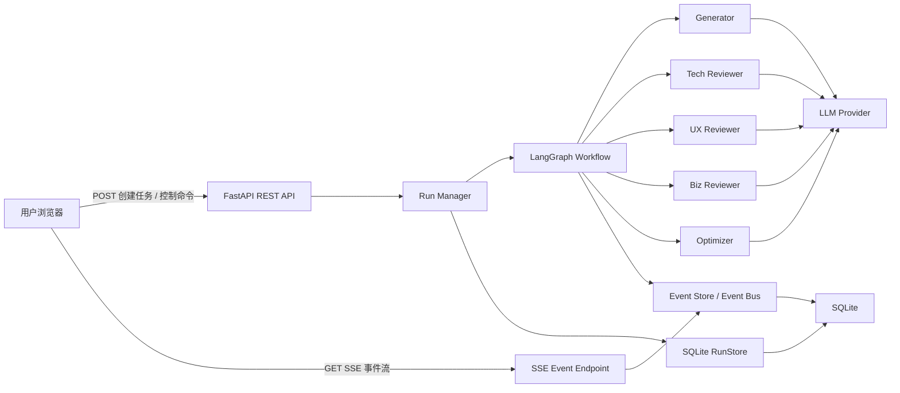
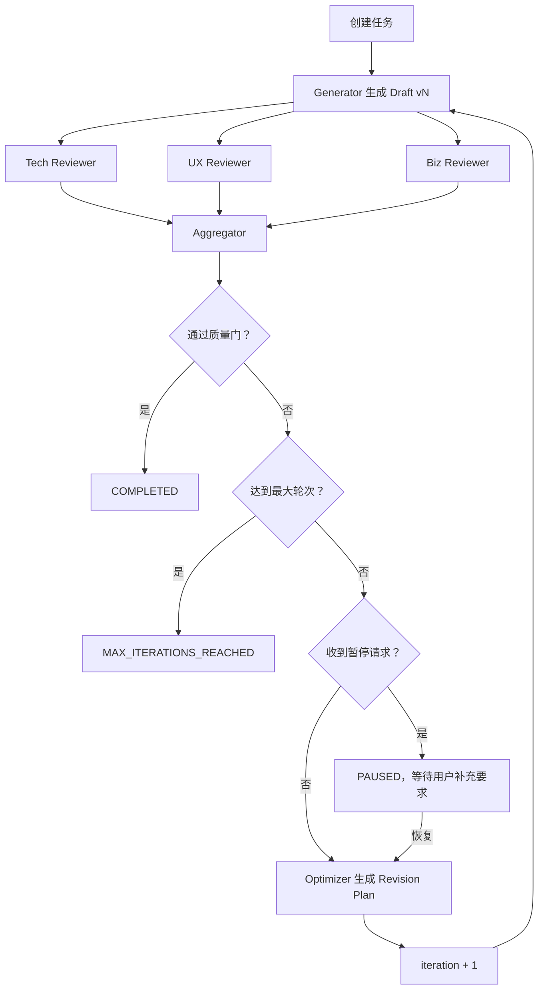

# Agentic PRD Architect 项目详细设计文档

> 文档版本：1.0  
> 文档状态：可进入实现  
> 需求来源：`PRD.md`  
> 产品定位：Showcase-first，Production-shaped  
> 默认运行形态：本地单机、单进程、支持 Mock LLM 与真实 LLM

---

## 1. 文档目的

本文档将 `PRD.md` 中的产品需求转化为可直接指导开发、联调和验收的技术设计，重点明确以下内容：

除非特别说明，本文档中的文件路径均以仓库根目录为基准。

- Generator、三个独立 Reviewer、Optimizer 之间的职责边界。
- LangGraph Agentic Loop 的状态结构、节点结构和终止条件。
- 后端任务模型、暂停/恢复/取消语义。
- REST API 与 SSE 实时事件协议。
- Astro + React 前端组件、状态管理与交互设计。
- Mock LLM、错误处理、可观测性、测试与验收标准。
- 第一版明确不实现的能力以及未来扩展边界。

本文档优先保证核心 Agent Loop 的展示效果、代码结构和运行稳定性，不把第一版扩展为完整的多租户 SaaS。

---

## 2. 产品概述

### 2.1 产品目标

Agentic PRD Architect 接收用户输入的简短产品想法，自动执行以下闭环：

1. Generator 生成结构化 PRD 初稿。
2. Tech Reviewer、UX Reviewer、Biz Reviewer 并行评审。
3. 后端聚合三方评分和反馈。
4. 当总分低于质量阈值时，Optimizer 将反馈整理为明确的修订计划。
5. Generator 根据原始需求、上一版 PRD 和修订计划生成下一版本。
6. 达到质量阈值或最大迭代次数后结束。
7. 前端实时展示 Agent 节点状态、评审反馈、分数变化、PRD 增量、版本历史、耗时和成本估算。

### 2.2 核心展示价值

- 展示真实的多 Agent 分工，而不是单次模型调用伪装成多个角色。
- 展示可观察、可暂停、可恢复、可取消的迭代式工作流。
- 展示结构化评审结果如何驱动下一轮生成。
- 展示质量分数和 PRD 内容在多轮迭代中的变化。
- 无 API Key 时仍可通过 Mock 模式完整演示。

### 2.3 第一版非目标

第一版不实现：

- 用户注册、登录、权限和多租户。
- 云端分布式任务队列。
- PostgreSQL、Redis 或外部消息队列。历史记录由本地 SQLite 承担，见第 8.6 节。
- 团队协作、评论、分享链接。
- 手工编辑 PRD 正文，以及 PDF / DOCX 导出。
- 终态任务的继续优化：终态不可回到运行态。
- 在线计费或配额系统。
- 完整的模型供应商管理后台。
- 对模型原始隐藏思维链的展示。
- 生产环境部署编排和高可用方案。

---

## 3. 已确定的关键架构决策

### 3.1 三个独立 Reviewer 并行执行

Tech、UX、Biz 使用独立 Prompt 和独立结构化输出。三个任务并行执行，全部成功后由确定性代码聚合结果。

优势：

- 三种角色边界清晰。
- 前端可以分别展示三个 Agent 的运行状态。
- 单个角色可单独超时和重试。
- 避免单次 Panel Prompt 中的角色混淆。
- 并行执行可控制总评审延迟。

### 3.2 使用“创建任务 + GET SSE 订阅”协议

不使用单个 POST 请求长时间保持输出流。调用流程为：

1. `POST /api/runs` 创建任务并获得 `run_id`。
2. `GET /api/runs/{run_id}/events` 通过原生 `EventSource` 订阅 SSE。
3. 通过独立接口暂停、恢复或取消任务。
4. 通过快照接口恢复页面状态。

该方案支持浏览器原生 SSE 自动重连、事件 ID、任务控制和页面刷新后的恢复。

### 3.3 Showcase-first，Production-shaped

本地版本通过 Store 边界将运行快照、版本历史和业务事件写入 SQLite。服务重启后历史对话仍可读取；重启时尚未完成的 Run 不自动续跑，而是标记为 `RUN_INTERRUPTED`，避免产生无法控制的僵尸任务。

“Production-shaped”在本项目中的含义是：

- 清晰的模块边界和类型定义。
- 输入校验、超时、重试、取消和错误事件。
- 确定性的状态迁移。
- 可测试的接口和 Mock。
- 结构化日志、指标和成本估算。
- 后续可替换存储与模型 Provider。

---

## 4. 总体架构

### 4.1 系统上下文



### 4.2 运行时组件

| 组件 | 职责 |
|---|---|
| Astro 页面 | 页面壳、基础 SEO、加载 React Island |
| React Dashboard | 对话侧栏、表单、任务控制、SSE 连接、状态归并和可视化 |
| FastAPI API | 创建任务、列出对话、查询快照、控制任务、健康检查 |
| SSE Endpoint | 按任务推送带 ID 的结构化事件 |
| Run Manager | 管理后台协程、运行生命周期和控制信号 |
| LangGraph Workflow | 执行 Generator、Reviewers、Aggregator、Optimizer 循环 |
| LLM Provider | 封装真实模型和 Mock 模型 |
| RunStore | 保存运行快照、PRD 版本和控制状态 |
| Event Store | 保存每个任务的事件序列并通知 SSE 订阅者 |

### 4.3 推荐目录结构

```text
agentic-prd-architect/
├── backend/
│   ├── __init__.py
│   ├── main.py
│   ├── config.py
│   ├── schemas.py
│   ├── prompts.py
│   ├── workflow.py
│   ├── run_manager.py
│   ├── event_store.py
│   ├── providers/
│   │   ├── base.py
│   │   ├── compatible.py
│   │   ├── mock.py
│   │   └── scenario.py
│   ├── observability.py
│   ├── requirements.txt
│   └── tests/
│       ├── test_schemas.py
│       ├── test_graph.py
│       ├── test_run_manager.py
│       ├── test_api.py
│       └── test_sse.py
├── src/
│   ├── layouts/
│   │   └── Layout.astro
│   ├── pages/
│   │   └── index.astro
│   ├── components/
│   │   ├── AgentDashboard.tsx
│   │   ├── ProductIdeaForm.tsx
│   │   ├── RunControls.tsx
│   │   ├── AgentTrace.tsx
│   │   ├── RadarScoreChart.tsx
│   │   ├── WorkflowDiagram.tsx
│   │   ├── PRDViewer.tsx
│   │   └── TelemetryPanel.tsx
│   ├── hooks/
│   │   └── useAgentRun.ts
│   ├── lib/
│   │   ├── api.ts
│   │   ├── config.ts
│   │   ├── contracts.ts
│   │   ├── runReducer.ts
│   │   └── types.ts
│   └── styles/
│       └── global.css
├── public/
├── .env.example
├── package.json
├── astro.config.mjs
├── tailwind.config.mjs
├── tsconfig.json
├── PRD.md
├── AGENTS.md
└── memory-bank/
    ├── design-document.md
    ├── tech-stack.md
    ├── implementation-plan.md
    ├── architecture.md
    └── progress.md
```

---

## 5. 核心领域模型

### 5.1 状态枚举

任务状态 `RunStatus`：

```text
QUEUED
GENERATING
REVIEWING
AGGREGATING
OPTIMIZING
PAUSE_REQUESTED
PAUSED
CANCEL_REQUESTED
COMPLETED
MAX_ITERATIONS_REACHED
CANCELLED
FAILED
```

节点状态 `NodeStatus`：

```text
PENDING
RUNNING
SUCCEEDED
FAILED
SKIPPED
```

结束状态含义：

- `COMPLETED`：最新总分达到质量阈值。
- `MAX_ITERATIONS_REACHED`：达到最大轮次，但分数仍未达到阈值。
- `CANCELLED`：用户取消任务。
- `FAILED`：不可恢复的模型、解析或系统错误。

### 5.2 Reviewer 输出

每个 Reviewer 返回自己的结构化结果：

```python
class FeedbackSeverity(StrEnum):
    MUST_FIX = "must_fix"
    SHOULD_FIX = "should_fix"
    OPTIONAL = "optional"

class FeedbackItem(BaseModel):
    severity: FeedbackSeverity
    issue: str
    recommendation: str

class RoleReview(BaseModel):
    role: Literal["tech", "ux", "biz"]
    score: int = Field(..., ge=0, le=100)
    summary: str
    strengths: list[str] = Field(default_factory=list)
    feedback: list[FeedbackItem] = Field(default_factory=list)
```

约束：

- `feedback` 必须是可执行修改项，不接受抽象评价。
- 每条反馈只描述一个问题，并显式声明严重程度。
- 只有 `must_fix` 参与质量门；`should_fix` 与 `optional` 是可以与已完成 PRD
  共存的建议。
- `summary` 用于前端展示，不包含隐藏思维过程。
- Score 必须是整数且处于 0–100。

历史兼容：早于 severity 的运行记录里 `feedback` 是裸字符串列表。后端
`_coerce_feedback` 与前端 `normalizeFeedbackItem` 都把这类数据归为
`should_fix`，绝不归为 `must_fix`——否则一个已经完成的历史任务会被重新判为
未完成。

### 5.3 聚合评审结果

```python
class EvaluationResult(BaseModel):
    tech: RoleReview
    ux: RoleReview
    biz: RoleReview
    overall_score: float = Field(..., ge=0, le=100)
    combined_feedback: list[FeedbackItem] = Field(default_factory=list)

    def severity_counts(self) -> dict[str, int]: ...
```

`overall_score` 由后端计算：

```text
round((tech.score + ux.score + biz.score) / 3, 1)
```

模型返回的总分即使存在也不采用，以保证结果确定性。

`severity_counts()` 每次按需从 `combined_feedback` 推导，不作为总数持久化：
统计数字与它所概括的反馈列表之间不允许存在可以互相矛盾的机会。前端在事件
payload 缺少计数字段时，同样从已收到的三份 review 重算，使实时路径与快照恢复
路径给出同一组数字。

### 5.4 修订计划

Optimizer 不直接生成最终 PRD，而是生成结构化修订计划：

```python
class RevisionItem(BaseModel):
    source_role: Literal["tech", "ux", "biz", "user"]
    issue: str
    required_change: str
    target_section: str
    priority: Literal["high", "medium", "low"]

class RevisionPlan(BaseModel):
    iteration: int
    objective: str
    items: list[RevisionItem]
    user_override: str | None = None
```

Generator 必须逐条处理 `RevisionPlan.items`，但仍可重构整份 PRD，不能只在文末机械追加内容。

### 5.5 PRD 版本

```python
class PRDVersion(BaseModel):
    version: int
    content: str
    created_at: datetime
    evaluation: EvaluationResult | None = None
    revision_plan: RevisionPlan | None = None
    token_usage: TokenUsage
```

版本号与评审轮次统一：

- 初稿为 `v1`，对应 iteration 1。
- 第一次优化后为 `v2`，对应 iteration 2。
- 最大允许生成 `v3`。

### 5.6 任务状态

```python
class PRDRunState(BaseModel):
    run_id: UUID
    user_idea: str
    target_audience: str | None = None
    user_constraints: str | None = None
    current_iteration: int = 1
    max_iterations: int = 3
    quality_threshold: float = 85.0
    status: RunStatus = RunStatus.QUEUED
    active_node: str | None = None
    versions: list[PRDVersion] = Field(default_factory=list)
    current_prd: str = ""
    latest_evaluation: EvaluationResult | None = None
    pending_revision_plan: RevisionPlan | None = None
    pending_user_override: str | None = None
    node_statuses: dict[str, NodeStatus] = Field(default_factory=dict)
    node_timings: list[NodeTiming] = Field(default_factory=list)
    best_version: int | None = None
    best_score: float | None = None
    total_tokens: TokenUsage = Field(default_factory=TokenUsage)
    estimated_cost_usd: float = 0.0
    created_at: datetime
    updated_at: datetime
    started_at: datetime | None = None
    completed_at: datetime | None = None
    error: RunError | None = None
```

所有集合字段必须使用 `default_factory`，避免可变默认值共享。

`best_version` / `best_score` 跟踪的是历史最高分版本，不是最新版本。两者是终态
展示的必要信息：一个未达标而结束的任务里，最好的一版经常不是最后一版。

`node_timings` 每完成一次节点调用追加一条记录（节点、版本、attempt、墙钟秒数、
是否成功、输入/输出 Token）。失败的尝试也要记录——那正是慢任务需要暴露的调用，
隐藏它们会让记录时间与实际耗时对不上。

### 5.7 一次节点调用的耗时

```python
class NodeTiming(BaseModel):
    node: str
    version: int = Field(..., ge=1, le=5)
    attempt: int = 1
    seconds: float = Field(..., ge=0)
    succeeded: bool = True
    input_tokens: int = 0
    output_tokens: int = 0
```

---

## 6. Agentic Loop 详细设计

### 6.1 工作流



### 6.2 LangGraph 节点

| 节点 | 输入 | 输出 | 是否调用 LLM |
|---|---|---|---|
| `generate_draft` | 用户需求、上一版 PRD、修订计划 | 新 PRD 内容 | 是 |
| `review_tech` | 当前 PRD | Tech Review | 是 |
| `review_ux` | 当前 PRD | UX Review | 是 |
| `review_biz` | 当前 PRD | Biz Review | 是 |
| `aggregate_reviews` | 三份 Review | EvaluationResult | 否 |
| `quality_gate` | EvaluationResult、轮次配置 | 下一路由 | 否 |
| `wait_for_resume` | 控制状态 | 用户补充要求 | 否 |
| `optimize_plan` | PRD、三方反馈、用户补充要求 | RevisionPlan | 是 |
| `complete_run` | 最新版本 | 结束状态 | 否 |

### 6.3 Reviewer 并行策略

- 三个 Reviewer 在同一轮中并行启动。
- 最大并发默认为 3。
- 每个 Reviewer 独立记录 `node_started` 和 `node_completed`。
- 每个 Reviewer 有独立超时和重试计数。
- Aggregator 只在三份结果全部有效后执行。
- 某一 Reviewer 最终失败时，任务进入 `FAILED`，不使用两个分数推算总分。

### 6.4 轮次计数规则

1. 创建任务时 `current_iteration = 1`。
2. Generator 生成 `v1`。
3. 完成三个 Reviewer 和 Aggregator 后检查阈值。
4. 如果需要继续，Optimizer 先生成修订计划。
5. 在下一次调用 Generator 前执行 `current_iteration += 1`。
6. `current_iteration` 永远不允许超过 `max_iterations`。

### 6.5 终止条件

质量门是一个合取式：分数达标**且**没有遗留 `must_fix`。

```python
threshold_met = overall_score >= quality_threshold
gate_passed = threshold_met and must_fix_count == 0

if gate_passed:
    status = COMPLETED
elif current_iteration >= max_iterations:
    status = MAX_ITERATIONS_REACHED
else:
    continue_to_optimizer()
```

`threshold_met` 与 `gate_passed` 必须作为两个独立字段传给前端：目标 85 分的任务
可以拿到 91 分却仍被一条阻塞反馈拦住，这个状态既不能显示为失败，也不能显示为
已完成的文档。

`quality_threshold` 是提前结束的目标，`max_iterations` 是尝试预算，所以任务完全
可以在没有达到目标的情况下正常结束。此时终态必须同时说明两件事：目标未达到，
以及实际得分最高的是哪一版（`best_version` / `best_score`）。

终态 payload 携带的 `must_fix_count` / `should_fix_count` / `optional_count` 来自
最终一轮真实 evaluation，进入 `MAX_ITERATIONS_REACHED` 不会把它们清零。

质量阈值和最大轮次均由后端校验：

- `quality_threshold` 默认 85，允许范围 50–100。
- `max_iterations` 默认 3，允许范围 1–5。
- 前端第一版可固定显示默认值，也可以在“高级设置”中开放。

### 6.6 暂停安全点

暂停只在安全点生效，避免中断一个已经发出的模型请求：

1. 用户点击暂停后，任务先进入 `PAUSE_REQUESTED`。
2. 当前正在运行的节点允许完成。
3. 在 Aggregator 之后、Optimizer 之前检查暂停信号。
4. 如果需要暂停，进入 `PAUSED` 并发送 `run_paused`。
5. 用户可以填写“补充优化要求”。
6. Resume 请求把补充要求写入 `pending_user_override`。
7. 工作流继续执行 Optimizer。

如果用户在 Generator 或 Reviewer 执行期间点击暂停，界面显示“正在完成当前步骤，随后暂停”。

### 6.7 取消语义

- Cancel 可在任何非结束状态请求。
- 后端设置 `CANCEL_REQUESTED` 并触发取消信号。
- 能安全取消的等待任务应立即取消。
- 已发送且 Provider 不支持取消的模型调用可以等待返回，但返回结果不得再写入版本历史。
- 最终状态必须为 `CANCELLED`。
- 前端收到 `run_cancelled` 后关闭 SSE。

### 6.8 生成完整性与失败保留

一份流式生成的文档可能因为输出上限、安全过滤、资源拒绝或连接中断而结束，而这
几种情况产出的文本都*看起来*像一份 PRD。因此提交为 `PRDVersion` 之前必须通过两
个互相独立的信号：

1. Provider 的 `finish_reason`。
2. Completion sentinel：模型在最后一行写入的固定标记。它能覆盖 `finish_reason`
   覆盖不到的情况——Provider 报告 `stop` 而文档明显没写完。

任一信号不通过即拒绝该次尝试。sentinel 在展示、下载和版本对比前一律剥离，因此
不会进入任何读者可见的位置。

拒绝原因分为四类，各自映射到独立错误码：

| 判定 | 错误码 | 是否可重试 |
|---|---|---|
| 输出达到上限 | `PROVIDER_OUTPUT_TRUNCATED` | 是 |
| 模型提前结束（缺 sentinel） | `PROVIDER_OUTPUT_UNFINISHED` | 是 |
| 服务中断或未知停止原因 | `PROVIDER_OUTPUT_INTERRUPTED` | 是 |
| 内容安全策略拦截 | `PROVIDER_CONTENT_FILTERED` | 否 |

仅说“不完整”无法告诉用户该改什么，所以三个可重试原因必须保留各自的中文文案。

后续版本生成失败时，已经提交的版本、评审结果和修订计划全部保留。失败提示必须
指名失败的是哪一版，并列出幸存版本与最佳可用版本；只有 `versions` 为空、首版从
未落地时才允许显示「首版 PRD 生成失败」。

失败的生成尝试同样写入 `node_timings`，其 `succeeded=False`。

---

## 7. Agent 与 Prompt 设计

### 7.1 通用原则

- 系统 Prompt 与用户输入分离。
- 用户输入作为不可信数据处理，不允许覆盖系统角色与输出格式。
- 不要求模型输出隐藏推理过程。
- 模型只输出最终内容、摘要、评分、反馈和修订项。
- Reviewer 和 Optimizer 强制使用结构化输出。
- Generator 输出 Markdown 字符串。

### 7.2 Generator

Generator 角色：Principal Product Manager。

初稿必须包含：

1. Product Overview & Core Goal
2. Target Users and Assumptions
3. Key User Stories & Happy Path
4. Functional Requirements
5. Technical Constraints & API Contracts
6. Edge Cases, Failures, and Recovery Flows
7. Success Metrics and Counter-metrics
8. Rollout, Risks, and Open Questions

生成 v2/v3 时额外输入：

- 原始产品想法。
- 目标用户。
- 上一版完整 PRD。
- Revision Plan。
- 用户补充优化要求。

Generator 必须保持原需求意图，不得为了提高评分任意扩大产品范围。

### 7.3 Tech Reviewer

检查维度：

- API 输入、输出、错误码和幂等性。
- 数据模型、一致性和状态同步。
- 并发、重试、重复提交和竞态。
- 扩展性、性能和容量风险。
- 安全、隐私和合规边界。
- 外部依赖失败与恢复策略。
- 技术约束是否可验证。

### 7.4 UX Reviewer

检查维度：

- 用户目标和关键路径是否完整。
- Loading、Empty、Error、Timeout 状态。
- 返回、撤销、取消、重试和反向流程。
- 文案、反馈、可理解性和可恢复性。
- 无障碍和响应式体验。
- 高延迟、弱网和跨设备状态。
- 边界用户与异常输入。

### 7.5 Biz Reviewer

检查维度：

- 用户价值是否明确。
- North Star Metric 是否可测量。
- Counter-metrics 和 Guardrail Metrics。
- 收益、成本、风险和 ROI 假设。
- 上线策略和验证方法。
- 功能范围与优先级。
- 成功/失败判断标准。

### 7.6 Optimizer

Optimizer 角色不是 PRD 作者，而是修订规划者。它需要：

- 合并重复反馈。
- 识别不同 Reviewer 之间的冲突。
- 按高、中、低优先级排序。
- 将每条反馈映射到目标章节。
- 把用户补充要求标为 `source_role = user`。
- 保证所有高优先级意见进入 Revision Plan。
- 不自行更改评分。

### 7.7 模型 Provider

第一版定义统一接口：

```python
class LLMProvider(Protocol):
    async def generate_markdown(...) -> LLMTextResult: ...
    async def generate_structured(..., schema: type[T]) -> LLMStructuredResult[T]: ...
```

实现：

- `OpenAICompatibleLLMProvider`：通过 OpenAI 兼容 Chat Completions 协议接入 DeepSeek 或 GLM。
- `MockLLMProvider`：本地演示和测试。
- `ScenarioMockLLMProvider`：仅在显式 E2E 测试模式下注入确定性故障。

Provider、Base URL 和模型名称通过环境变量配置，不硬编码到业务逻辑。第一版不宣称支持未实现、未测试的其他 Provider。

---

## 8. 后端设计

### 8.1 FastAPI 应用

`main.py` 负责：

- 创建 FastAPI 实例。
- 注册 CORS、异常处理和生命周期钩子。
- 初始化 Config、RunStore、EventStore、Provider 和 RunManager。
- 注册 REST 与 SSE 路由。
- 关闭服务时取消后台任务。

### 8.2 Run Manager

`RunManager` 是 API 和 LangGraph 之间的协调层：

```python
class RunManager:
    async def create_run(request: CreateRunRequest) -> RunSnapshot: ...
    async def start_run(run_id: UUID) -> None: ...
    async def get_run(run_id: UUID) -> RunSnapshot: ...
    async def request_pause(run_id: UUID) -> RunSnapshot: ...
    async def resume_run(run_id: UUID, override: str | None) -> RunSnapshot: ...
    async def cancel_run(run_id: UUID) -> RunSnapshot: ...
```

约束：

- 同一 `run_id` 只能有一个后台工作流。
- 控制操作必须使用锁或原子状态迁移。
- 对结束状态执行 pause/resume/cancel 返回 `409 Conflict`。
- 重复 cancel 可以按幂等方式返回当前 `CANCELLED` 快照。

### 8.3 RunStore

接口能力：

- 创建和读取任务快照。
- 原子更新状态。
- 追加 PRD 版本。
- 保存控制信号。
- 按 TTL 清理过期任务。

`SQLiteRunStore` 配置：

- 最大保留任务：100。
- 完成任务 TTL：30 天。
- JSON 快照写入 `runs` 表。
- 服务重启时恢复历史终态并终止中断状态。
- 每个任务单独使用 `asyncio.Lock`。

### 8.4 EventStore

每个任务维护：

- 递增事件 ID。
- 有界事件缓冲区。
- SQLite 中的完整业务事件记录。
- 一个用于唤醒订阅者的异步条件变量。
- 最近一次事件时间。

建议：

- 每个任务最多保留 1000 条事件（热回放缓冲）。
- `prd_delta` 只推送不落库，见第 10.3 节。
- 每 15 秒发送一次 heartbeat；heartbeat 不分配 sequence、不进入缓冲。
- 任务结束后允许 SSE 连接读取完缓冲事件再关闭。

### 8.5 后台任务

创建任务后使用 `asyncio.create_task` 启动工作流。RunManager 必须保存 Task 引用，避免任务被垃圾回收，并在完成回调中清理引用。

当前仍为单进程执行架构，不支持多个 Uvicorn Worker。SQLite 可以共享历史数据，但活动 Task、控制信号和 SSE Condition 不跨进程共享。

### 8.6 SQLite 持久化边界

SQLite 是历史的事实来源，进程内对象是活动运行的热缓存与协调层。每次
`RunManager.commit()` 或状态迁移都先追加业务事件、再持久化包含最新 sequence 的
快照；如果进程在两次写入之间退出，重启后的 SSE 可以从较旧的快照 sequence 补发。

活动工作流不做进程级 checkpoint。重启时非终态快照统一转为 `RUN_INTERRUPTED`，
历史 PRD、评审和事件仍可浏览，但不会自动续跑。

SQLite 不改变单 Worker 约束，因为 Task、Run 锁、取消/恢复信号和订阅 Condition
仍在进程内。终态任务不能回到运行态，因此“继续优化一个已结束的任务”不是重启
恢复能力的一部分。

`severity_counts()` 是从存储的反馈推导的，不是持久化的总数，因此快照往返 JSON
之后必须给出与运行期完全一致的数字。

---

## 9. REST API 设计

统一前缀：`/api`

### 9.1 创建任务

```http
POST /api/runs
Content-Type: application/json
```

请求：

```json
{
  "user_idea": "Build a micro-subscription feature for a podcast app that lets listeners pay $0.10 per episode.",
  "target_audience": "Podcast listeners and independent creators",
  "user_constraints": "Focus on a mobile-first MVP",
  "quality_threshold": 85,
  "max_iterations": 3
}
```

校验：

- `user_idea`：必填，10–5000 字符。
- `target_audience`：可选，最多 1000 字符。
- `user_constraints`：可选，最多 2000 字符。
- `quality_threshold`：50–100。
- `max_iterations`：1–5。

响应：`202 Accepted`

```json
{
  "run_id": "0c98322f-51a5-47f0-8091-d8152df0e680",
  "status": "QUEUED",
  "events_url": "/api/runs/0c98322f-51a5-47f0-8091-d8152df0e680/events",
  "created_at": "2026-07-26T10:00:00Z"
}
```

### 9.2 获取任务快照

```http
GET /api/runs/{run_id}
```

响应包含：

- 当前状态和活动节点。
- 当前最新事件序号 `latest_event_sequence`。
- 三个 Reviewer 的节点状态。
- 当前轮次。
- 最新 PRD。
- 所有已完成版本及评分。
- Token、费用和耗时。
- 最近错误。

快照用于：

- 页面刷新后恢复。
- SSE 重连前校准状态。
- 事件过期后的降级恢复。

### 9.3 订阅 SSE

```http
GET /api/runs/{run_id}/events?after_sequence=42
Accept: text/event-stream
Last-Event-ID: 42
```

`after_sequence` 用于页面刷新后的显式恢复，`Last-Event-ID` 用于同一个 `EventSource` 实例自动重连。二者同时存在时取较大的合法值。

响应头：

```text
Content-Type: text/event-stream
Cache-Control: no-cache
Connection: keep-alive
X-Accel-Buffering: no
```

### 9.4 请求暂停

```http
POST /api/runs/{run_id}/pause
```

成功响应：

```json
{
  "run_id": "...",
  "status": "PAUSE_REQUESTED",
  "message": "The run will pause at the next safe point."
}
```

如果任务正好位于安全点，可直接返回 `PAUSED`。

### 9.5 恢复任务

```http
POST /api/runs/{run_id}/resume
Content-Type: application/json
```

请求：

```json
{
  "user_override": "Add an explicit refund flow and creator payout reconciliation."
}
```

约束：

- 仅 `PAUSED` 状态可恢复。
- `user_override` 可为空，最大 2000 字符。
- 恢复后进入 `OPTIMIZING`。

### 9.6 取消任务

```http
POST /api/runs/{run_id}/cancel
```

成功返回最新状态。重复取消保持幂等。

### 9.7 健康检查

```http
GET /api/health
```

响应：

```json
{
  "status": "ok",
  "mock_mode": true,
  "provider": "mock"
}
```

健康检查不得返回 API Key 或其他敏感配置。

### 9.8 错误响应

统一格式：

```json
{
  "error": {
    "code": "RUN_NOT_PAUSED",
    "message": "Only a paused run can be resumed.",
    "request_id": "..."
  }
}
```

主要状态码：

| HTTP 状态 | 场景 |
|---|---|
| 400 | JSON 或业务参数无效 |
| 404 | `run_id` 不存在或已过期 |
| 409 | 当前状态不允许执行控制操作 |
| 410 | `Last-Event-ID` 早于事件缓冲区 |
| 422 | Pydantic 请求校验失败 |
| 429 | 达到本地并发任务上限 |
| 500 | 未预期服务错误 |
| 503 | LLM Provider 不可用 |

---

## 10. SSE 事件协议

### 10.1 标准格式

```text
id: 17
event: review_completed
data: {"run_id":"...","sequence":17,"timestamp":"2026-07-26T10:00:08Z","payload":{...}}

```

事件名使用 SSE 的 `event:` 字段，不再只把事件类型嵌套在 JSON 中。

### 10.2 通用事件信封

```typescript
interface RunEvent<T> {
  run_id: string;
  sequence: number;
  timestamp: string;
  iteration: number;
  payload: T;
}
```

### 10.3 事件类型

| 事件 | 触发时机 | 关键字段 |
|---|---|---|
| `run_started` | 后台工作流启动 | status、config |
| `status_changed` | 任务状态改变 | previous、current |
| `node_started` | 节点开始 | node、role |
| `prd_delta` | Generator 输出增量 | version、delta |
| `prd_stream_reset` | 生成重试，丢弃上一 attempt 的增量 | version、attempt |
| `prd_generated` | 一版 PRD 完成 | version、content |
| `review_completed` | 单个 Reviewer 完成 | role、score、summary、feedback |
| `scores_updated` | 三方聚合完成 | tech、ux、biz、overall、best_version、best_score、三个 severity 计数、quality_gate_passed |
| `revision_planned` | Optimizer 完成 | revision_plan |
| `pause_requested` | 收到暂停请求 | safe_point |
| `run_paused` | 已进入安全暂停点 | iteration |
| `run_resumed` | 用户恢复 | has_user_override |
| `telemetry_updated` | 用量变化 | tokens、cost、elapsed |
| `run_completed` | 通过质量门 | final_version、final_score、best_version、best_score、threshold_met、quality_gate_passed、三个 severity 计数、completed_iterations、max_iterations |
| `max_iterations_reached` | 尝试预算用尽 | 同 `run_completed` |
| `run_cancelled` | 取消完成 | reason |
| `run_failed` | 不可恢复错误 | error_code、message、retryable |
| `heartbeat` | 保活 | status |

`run_failed` 的原因字段名是 `error_code`（不是 `code`）。前端据此查表得到安全的
中文文案；Provider 原始错误文本、stack trace 和密钥都不进入 payload。

`prd_delta` 是唯一的 live-only 事件：它只推送给订阅者，不写入 SQLite。完整正文由
`prd_generated` 持久化，重连客户端靠快照校准，不靠 delta 回放。

### 10.4 `prd_delta` 合并

为兼顾视觉流畅和事件数量：

- Provider token 可以在后端先缓冲。
- 每 30–80 毫秒或累计一定字符后发送一个 delta。
- `prd_generated` 始终发送完整最终内容，用于校准。
- 前端收到完整内容后替换增量拼接结果，避免漏字或重复。

### 10.5 重连与补发

1. 浏览器 `EventSource` 自动带上 `Last-Event-ID`。
2. EventStore 从下一事件开始补发。
3. 如果事件仍在缓冲区，补发后进入实时订阅。
4. 如果请求的事件已被淘汰，返回 `410 Gone`。
5. 页面刷新时先获取快照，再使用快照中的 `latest_event_sequence` 构造 `after_sequence`。
6. 原生 EventSource 无法直接读取错误响应正文；前端连续重连失败后调用快照 API，再建立新 SSE 连接。

第一版只保证同一服务进程生命周期内的重连。

---

## 11. 前端详细设计

### 11.1 页面布局

桌面端为左侧版本轨（Version Rail）+ 右侧工作区：

- 左列：对话记录与版本轨，用于在历史 Run 和同一 Run 的多个版本之间切换。
- 右列：运行头部（状态、终态摘要、失败提示）加一组工作区 Tab。

工作区 Tab 固定为五个：

| Tab | 内容 |
|---|---|
| `PRD` | 当前选中版本的正文、流式标识和下载入口 |
| `评审` | 三个 Reviewer 的评分、摘要与按 severity 分组的反馈 |
| `修订计划` | 产出所选版本的 Revision Plan |
| `对比` | 所选版本与上一版的差异 |
| `运行记录` | 工作流图、事件 Trace、遥测与 per-node 耗时 |

只有 `PRD` 永不禁用；其余 Tab 在对应数据尚未产生时禁用。「运行记录」把“任务是
怎么跑出来的”与“任务产出了什么”分开，而不是让工作流图和 Trace 与 PRD 正文并列。

移动端改为单列：输入与控制区 → 状态与终态摘要 → 版本选择 → 工作区 Tab。

### 11.2 AgentDashboard

职责：

- 保存当前 `run_id`。
- 发起创建任务请求。
- 初始化 `useAgentRun`。
- 组合所有子组件。
- 控制空态、运行态、结束态和错误态。

主界面状态：

```text
EMPTY
CREATING
RUNNING
PAUSING
PAUSED
FINISHED
ERROR
```

### 11.3 `useAgentRun`

Hook 负责：

- 获取任务快照。
- 建立和关闭 EventSource。
- 将所有 SSE 事件派发给 reducer。
- 暴露 pause、resume、cancel、retryConnection。
- 维护连接状态和最后事件 ID；页面恢复时使用 `after_sequence`。
- 组件卸载时关闭连接。

建议返回：

```typescript
{
  state,
  connectionStatus,
  pause,
  resume,
  cancel,
  reconnect
}
```

### 11.4 状态 Reducer

使用 `useReducer`，不为第一版引入全局状态框架。Reducer 必须满足：

- 根据 `sequence` 忽略重复事件。
- 对乱序事件不回退状态。
- `prd_delta` 追加到当前版本草稿。
- `prd_generated` 使用完整内容校准。
- `review_completed` 只更新对应角色。
- `scores_updated` 创建可供 Recharts 使用的版本数据。
- 结束事件锁定最终状态。

### 11.5 MermaidDiagram

节点：

```text
Generator
Tech Reviewer
UX Reviewer
Biz Reviewer
Aggregator
Optimizer
Complete
```

显示规则：

- `PENDING`：灰色。
- `RUNNING`：绿色高亮并带轻微动画。
- `SUCCEEDED`：蓝绿色。
- `FAILED`：红色。
- `SKIPPED`：浅灰。

Mermaid 仅在浏览器初始化：

```astro
<AgentDashboard client:only="react" />
```

React 内部使用 `useEffect` 调用 `mermaid.render()`，每次使用唯一 diagram ID，避免重复渲染冲突。

### 11.6 LoopTraceViewer

按时间顺序显示结构化执行轨迹：

- 节点开始和完成。
- Reviewer 摘要与反馈数量。
- 分数聚合。
- 暂停、恢复和取消。
- 可恢复/不可恢复错误。

不显示原始隐藏思维链。日志文案由事件结构生成，避免直接渲染不可信 HTML。

### 11.7 RadarScoreChart

维度：

- Technical
- UX
- Business

每个 PRD 版本是一组数据：

```typescript
{
  version: "v2",
  tech: 88,
  ux: 90,
  biz: 86,
  overall: 88
}
```

要求：

- 同时比较 v1、v2、v3。
- 分值固定 0–100。
- 图例颜色与版本 Tab 一致。
- 图表为空时显示 Skeleton 或说明文本。
- 移动端允许横向紧凑展示或降级为分数卡片。

### 11.8 PRDViewer

功能：

- 版本 Tabs。
- 显示各版本总分和三项分数。
- 流式生成时显示光标或 Streaming 标识。
- 使用 `react-markdown` + `remark-gfm` 渲染，GFM 表格是 Generator 明确使用的
  表达方式，必须正确渲染。
- 默认禁止原始 HTML（`skipHtml`）。
- 支持下载当前选中版本。
- 最新版本完成后自动选中；用户手动选择旧版本后不强制跳回。

下载文件名：

```text
agentic-prd-v1.md
agentic-prd-v2.md
agentic-prd-final.md
```

### 11.8.1 Mermaid 代码块

PRD 正文里的 ```mermaid 代码块由 `MermaidBlock` 渲染，规则如下：

- 类型白名单：`flowchart`（含 `graph` 别名）、`sequenceDiagram`、
  `stateDiagram-v2`、`mindmap`、`erDiagram`。白名单外的定义不渲染。
- Mermaid 运行库延迟加载：只有页面上真的出现图表时才下载。
- `startOnLoad: false`、`securityLevel: "strict"`、`htmlLabels: false`：模型写出的
  标签不会成为可执行 HTML。
- 定义无法解析时降级显示图表源码，而不是留下空白或错误堆栈。

### 11.8.2 版本对比

对比提供两种视图：

- 「阅读对比」：按文档块（标题、段落、表格、列表、代码块）呈现新增与删除，未变化
  的段落折叠计数，让读者按阅读顺序理解这一版改了什么。
- 「源码」：逐行 diff，作为精确核对的退路。

### 11.9 终态与失败展示

终态摘要必须同时给出三类事实，且彼此不可混淆：

- 结论：通过质量门 / 达标但被阻塞 / 未达到目标。
- 目标与实际：目标分数、最佳版本及其分数、已完成轮次 / 预算轮次。
- 遗留项：`must_fix` / `should_fix` / `optional` 三个数量，来自最终一轮真实
  evaluation。

失败提示（后续版本生成失败）必须指名失败版本、列出幸存版本与最佳可用版本。顶部
全局错误 Banner 使用按 error code 查表得到的具体中文文案，不得对已知错误码显示
通用兜底句，也不得展示 Provider 原始错误文本。

### 11.10 RunControls

按钮规则：

| 状态 | 可用操作 |
|---|---|
| 未开始 | Generate |
| 运行中 | Pause、Cancel |
| PAUSE_REQUESTED | Cancel |
| PAUSED | Resume with Instructions、Cancel |
| COMPLETED | New Run、Download |
| MAX_ITERATIONS_REACHED | New Run、Download |
| FAILED | New Run（当前版本不提供 Retry 按钮） |

暂停弹窗中的输入名称应为“补充优化要求”，而不是“编辑系统 Prompt”。

### 11.11 无障碍与安全

- 所有图标按钮必须有 `aria-label`。
- 状态变化使用 `aria-live="polite"`。
- 不只依靠颜色区分状态。
- 支持键盘切换版本 Tab。
- Markdown 不允许不可信 HTML 和脚本。
- 下载内容使用浏览器 Blob，不向服务端写文件。

---

## 12. Mock LLM 设计

### 12.1 启用方式

```env
ENABLE_MOCK_LLM=true
```

规则：

- `true` 时不得调用外部模型。
- `false` 时必须验证真实 Provider 所需配置。
- 不因缺少 API Key 静默切换 Mock，避免用户误以为使用了真实模型。

### 12.2 默认演示场景

测试输入：

> Build a micro-subscription feature for a podcast app that lets listeners pay $0.10 per episode.

Mock 行为：

#### Iteration 1

- Generator 流式输出基础 PRD。
- Tech：65。
- UX：70。
- Biz：78。
- Overall：71.0。
- 反馈包含支付网关失败、网络重试、欺诈防护、退款流程和 Guardrail Metrics。

#### Iteration 2

- Optimizer 生成修订计划。
- Generator 输出包含 Gateway Error & Retry Fallbacks、退款和欺诈防护的新版本。
- Tech：88。
- UX：89。
- Biz：87。
- Overall：88.0。
- 任务进入 `COMPLETED`。

### 12.3 Mock 时序

不建议每个节点都固定等待 2 秒，否则整轮演示过慢。建议：

- Generator：总计约 1.5–2 秒，分批发送 delta。
- 三个 Reviewer：并行，各约 0.8–1.2 秒。
- Aggregator：约 0.2 秒。
- Optimizer：约 0.8 秒。

完整两轮演示控制在约 8–12 秒。

### 12.4 可测试性

Mock 输出必须：

- 确定性，不依赖随机数。
- 支持注入超时、格式错误和单 Agent 失败。
- 可以关闭实际 sleep，使自动测试快速运行。

---

## 13. Telemetry 与成本估算

### 13.1 Token Usage

```python
class TokenUsage(BaseModel):
    input_tokens: int = 0
    output_tokens: int = 0
    total_tokens: int = 0
```

每次调用按节点记录，并累计到任务级别。

### 13.2 成本

成本由后端根据 Provider 返回的 usage 和配置的模型单价估算：

```text
input_cost = input_tokens / 1_000_000 × input_price
output_cost = output_tokens / 1_000_000 × output_price
```

模型价格不写死在业务代码中，通过配置表维护。前端必须标注为 Estimated Cost。

Mock 模式：

- 可以模拟 Token 数量。
- `estimated_cost_usd` 默认显示 `$0.0000`，并标注 Mock。

### 13.3 耗时

- 使用后端时间戳计算任务真实耗时。
- 前端可每秒本地刷新显示，但最终以结束事件中的服务端耗时校准。
- 每完成一次节点调用都追加一条 `NodeTiming`，在「运行记录」中按节点、版本、
  attempt 展示墙钟秒数与 Token。失败的尝试同样记录，否则记录时间无法与总耗时
  对上。
- `node_timings` 不属于 `parseRunSnapshot` 的必需字段：早于该字段的历史快照没有
  它。遥测列表读不懂的数据一律丢弃，绝不能因为它而让一份已完成的 PRD 无法渲染。

---

## 14. 错误处理与安全护栏

### 14.1 结构化输出解析

Reviewer 和 Optimizer 的处理顺序：

1. 优先使用 Provider 原生 structured output。
2. 通过 Pydantic 校验。
3. 校验失败后，将错误摘要和原响应交给同一 Provider 做一次格式修复。
4. 再次校验。
5. 仍失败则标记该节点失败。

不建议使用宽松正则“猜测”分数，因为可能产生错误但看似合法的评价结果。

### 14.2 重试策略

可重试错误：

- 429。
- 临时 5xx。
- 网络连接重置。
- Provider 超时。
- 第一次结构化输出校验失败。

建议：

- 每个 LLM 节点最多 2 次正常请求尝试。
- 指数退避并添加少量 jitter。
- 格式修复最多 1 次。
- 不对认证失败和无效模型名重试。

### 14.3 超时

建议默认值：

- Generator：90 秒。
- Reviewer：45 秒。
- Optimizer：60 秒。
- 单任务总时长：10 分钟。

所有超时可通过环境变量调整。

### 14.4 无限循环防护

- `max_iterations` 在请求层和图路由层双重校验。
- 每次进入 Generator 前断言当前轮次合法。
- 记录已执行节点计数；超过预期上限时任务失败。
- 结束状态不可重新进入图。

### 14.5 输入和 Prompt Injection

- 限制输入长度。
- 用户内容使用明确的数据边界标签传给模型。
- 系统 Prompt 明确要求忽略用户内容中的角色覆盖指令。
- 不把用户输入拼接成可执行代码或模板语法。
- 不向前端返回 Provider 原始异常正文中的敏感信息。

### 14.6 CORS

开发环境允许：

```text
http://localhost:4321
http://127.0.0.1:4321
```

允许 Origin 通过环境变量覆盖。第一版不使用 `*` 与 credentials 的组合。

### 14.7 并发限制

默认：

- 同时运行任务上限：4。
- 单任务 Reviewer 并发：3。
- 超出上限的创建请求返回 429，或进入有界队列。

第一版优先返回 429，避免实现复杂任务队列。

---

## 15. 配置设计

`.env.example`：

```env
APP_ENV=development
APP_HOST=127.0.0.1
APP_PORT=8000
FRONTEND_ORIGINS=http://localhost:4321,http://127.0.0.1:4321
PUBLIC_API_BASE_URL=http://127.0.0.1:8000

ENABLE_MOCK_LLM=true
LLM_PROVIDER=deepseek
LLM_REQUEST_TIMEOUT_SECONDS=90
LLM_MAX_OUTPUT_TOKENS=16000
DEEPSEEK_API_KEY=
DEEPSEEK_BASE_URL=https://api.deepseek.com
DEEPSEEK_MODEL=deepseek-v4-flash

# GLM provider (currently disabled)
# LLM_PROVIDER=glm
# GLM_API_KEY=
# GLM_BASE_URL=https://open.bigmodel.cn/api/paas/v4
# GLM_MODEL=glm-5.2

DEFAULT_QUALITY_THRESHOLD=85
DEFAULT_MAX_ITERATIONS=3
MAX_CONCURRENT_RUNS=4
MAX_RETAINED_RUNS=100
RUN_TTL_SECONDS=2592000
EVENT_BUFFER_SIZE=1000
SSE_HEARTBEAT_SECONDS=15
DATABASE_PATH=data/agentic-prd.sqlite3

GENERATOR_TIMEOUT_SECONDS=240
REVIEWER_TIMEOUT_SECONDS=45
OPTIMIZER_TIMEOUT_SECONDS=60
RUN_TIMEOUT_SECONDS=600
```

完整键列表见仓库根目录的 `.env.example`。

`LLM_MAX_OUTPUT_TOKENS` 作为 `max_tokens` 显式发送。不发送它就沿用 Provider 服务端
默认值，该值随模型而变且小到足以把一份完整 PRD 截断在中途；显式发送后上限是一个
已配置的值，`finish_reason="length"` 报告的就是触达*这个*上限，Generator 会重试而
不是提交半份文档。

配置启动时校验：

- Mock 关闭时 Provider 配置必须完整。
- 所有数值必须在安全范围内。
- API Key 不得出现在日志、健康检查或前端响应中。

---

## 16. 依赖设计

### 16.1 后端

基础依赖：

```text
fastapi
uvicorn
langgraph
openai
pydantic
pydantic-settings
sse-starlette
python-dotenv
```

测试依赖：

```text
pytest
pytest-asyncio
httpx
```

如果实际实现不使用 LangChain，则不必仅为了满足原 PRD 而引入完整 `langchain` 包；LangGraph 与 Provider SDK 足以完成第一版。

### 16.2 前端

```text
astro
react
react-dom
@astrojs/react
@astrojs/tailwind
tailwindcss
react-markdown
remark-gfm
mermaid
recharts
lucide-react
```

测试建议：

```text
vitest
@testing-library/react
@testing-library/user-event
playwright
```

具体版本在实现初始化时统一锁定，并提交 lockfile。

---

## 17. 测试策略

### 17.1 后端单元测试

覆盖：

- 三项评分平均值和四舍五入。
- Pydantic 边界校验。
- 轮次递增和终止条件。
- Revision Plan 合并。
- 状态迁移合法性。
- Pause 安全点。
- Cancel 幂等性。
- Event ID 递增。
- TTL 和事件缓冲淘汰。
- Token 与成本累计。

### 17.2 Graph 测试

使用无 sleep 的 Mock Provider 验证：

- 第一轮低于阈值后进入 Optimizer。
- 第二轮达到阈值后完成。
- 第一轮直接达到阈值时不执行 Optimizer。
- 第三轮仍未达标时进入 `MAX_ITERATIONS_REACHED`。
- 三个 Reviewer 确实并行启动。
- 某 Reviewer 重试后成功。
- 某 Reviewer 最终失败导致任务失败。
- 暂停后不提前执行 Optimizer。
- Resume 的用户补充要求进入 Revision Plan。
- Cancel 后不写入晚到的模型结果。

### 17.3 API 测试

覆盖：

- 创建任务返回 202 和合法 URL。
- 无效输入返回 422。
- 未知任务返回 404。
- 非法状态控制返回 409。
- 健康检查不泄露敏感信息。
- 并发达到上限返回 429。
- CORS 只允许配置 Origin。

### 17.4 SSE 合约测试

验证：

- `Content-Type` 正确。
- 每个事件包含 id、event 和 data。
- 事件 ID 严格递增。
- heartbeat 格式正确。
- `Last-Event-ID` 能补发。
- 缓冲过期返回 410。
- 结束事件发送后连接正常关闭。

### 17.5 前端测试

覆盖：

- Reducer 忽略重复事件。
- PRD delta 正确拼接。
- 完整 PRD 校准增量内容。
- 三个 Reviewer 状态独立更新。
- Pause/Resume/Cancel 按状态启用。
- 版本 Tabs 切换。
- Markdown 安全渲染。
- 下载内容与选中版本一致。
- EventSource 断线重连后的快照恢复。

### 17.6 端到端测试

使用 Mock 模式执行 PRD 中的 Podcast 微订阅案例：

1. 输入产品想法。
2. 确认 Generator 流式输出 v1。
3. 确认三个 Reviewer 都出现运行和完成状态。
4. 确认 v1 总分约 71。
5. 确认 Optimizer 生成修订计划。
6. 确认 v2 包含支付网关失败、重试和欺诈防护。
7. 确认 v2 总分 88 并结束。
8. 确认雷达图同时显示 v1/v2。
9. 下载最终 Markdown 并检查内容。

另增加：

- 暂停并补充退款要求后恢复。
- 运行中取消。
- 模拟 Reviewer 格式错误。
- 模拟 SSE 断开后重连。

---

## 18. 验收标准

### 18.1 功能验收

- 用户可以创建 PRD 生成任务。
- Generator 可以流式生成 PRD。
- Tech、UX、Biz 三个 Reviewer 独立并行执行。
- 每个 Reviewer 返回结构化分数和反馈。
- 后端确定性计算总分。
- 未达阈值时生成 Revision Plan 并进入下一轮。
- 达标或达到最大轮次时正确结束。
- 用户可以在安全点暂停、补充优化要求、恢复和取消。
- 页面可以查看所有 PRD 版本。
- 雷达图可以比较不同版本评分。
- 可以下载选中版本 Markdown。
- Mock 模式无需外部 API 即可完成全流程。

### 18.2 稳定性验收

- Reviewer 返回非法结构不会破坏 SSE 连接。
- 模型错误通过结构化 `run_failed` 事件传达。
- 不会超过最大迭代次数。
- 断线重连不会重复拼接 PRD 内容。
- 页面刷新后可通过快照恢复当前任务。
- 单个任务取消后不再产生有效版本。

### 18.3 体验验收

- 用户可以明确看到当前 Agent 和当前轮次。
- 三个 Reviewer 并行状态可辨识。
- 状态变化不依赖颜色作为唯一信息。
- 流式 PRD 阅读过程中页面不明显跳动。
- 手机端可以完成创建、观察、暂停、恢复和下载。

---

## 19. 实施顺序

### Phase 1：领域模型与 Mock 工作流

- 建立 Pydantic Schema。
- 实现 Mock Provider。
- 实现 LangGraph 节点和循环。
- 完成评分、终止条件和状态测试。

### Phase 2：Run Manager、存储与事件

- 实现 RunStore 和 EventStore。
- 实现后台任务生命周期。
- 实现 Pause、Resume、Cancel。
- 完成事件 ID、缓冲和 heartbeat。

### Phase 3：REST 与 SSE

- 实现创建、快照、订阅和控制接口。
- 配置 CORS 和统一错误。
- 完成 API/SSE 合约测试。

### Phase 4：前端主流程

- 初始化 Astro、React、Tailwind。
- 实现输入、任务状态和 SSE Hook。
- 实现 PRD 流式渲染和版本历史。
- 实现暂停、恢复和取消。

### Phase 5：可视化与体验

- Mermaid 节点高亮。
- Recharts 版本评分比较。
- 遥测、成本和耗时。
- 响应式与无障碍。

### Phase 6：真实模型与验收

- 接入 DeepSeek/GLM OpenAI 兼容 Provider。
- 验证结构化输出、Token Usage 和错误重试。
- 执行完整 Mock E2E。
- 执行真实模型冒烟测试。
- 修复文档、启动脚本和环境示例。

---

## 20. 风险与应对

| 风险 | 影响 | 应对 |
|---|---|---|
| 真实模型评分波动 | 无法稳定复现 71→88 | 验收演示使用确定性 Mock |
| 三个 Reviewer 增加成本 | 每轮调用数增加 | 并行执行、限制轮数、显示成本 |
| SQLite 文件损坏或不可写 | 历史对话无法恢复或新状态无法落盘 | 启用 WAL、事务提交、启动时建表，并将数据库目录纳入本地备份 |
| SSE 事件过多 | 浏览器渲染频繁 | 合并 PRD delta、限制缓冲区 |
| EventSource 断线 | 页面状态不完整 | 事件 ID 补发 + 快照校准 |
| Pause 与模型调用竞态 | 用户以为立即暂停 | 使用 PAUSE_REQUESTED 和安全点语义 |
| 结构化输出失败 | 评分流程中断 | 原生 structured output、校验、修复、有限重试 |
| Mermaid 浏览器依赖 | Astro SSR 报错 | `client:only="react"` + `useEffect` |
| 成本估算过时 | 展示金额不准确 | 模型价格配置化并标注 Estimated |
| 单进程运行时协调 | 无法多 Worker 扩展实时控制与 SSE 通知 | 第一版固定单 Worker；扩展时将锁、控制信号和通知迁移到共享协调层 |

---

## 21. 后续扩展方向

不属于第一版，但当前设计应允许后续增加：

- Redis Event Store 和分布式 RunStore。
- PostgreSQL 长期保存项目和版本历史。
- Celery、Arq 或独立 Worker 执行任务。
- 用户身份、团队空间和访问控制。
- 多模型选择和 Provider 路由。
- Reviewer 权重配置。
- 自定义 Reviewer 角色。
- PRD Diff 视图。
- 用户直接编辑 PRD 后继续评审。
- 导出 PDF、DOCX 或同步到第三方文档平台。
- 公开分享和协作评论。

---

## 22. 最终设计结论

第一版采用以下基线：

1. Generator 负责生成 PRD。
2. Tech、UX、Biz 三个 Reviewer 独立并行评审。
3. 后端代码确定性聚合评分。
4. Optimizer 只生成结构化修订计划。
5. Generator 根据修订计划生成下一版本。
6. 质量阈值默认 85，最大迭代默认 3。
7. 达标与达到最大轮次使用不同结束状态。
8. 使用 `POST 创建任务 + GET SSE + 独立控制接口`。
9. Pause 在安全点生效，Resume 接收“补充优化要求”。
10. 前端展示结构化执行轨迹，不展示模型隐藏思维链。
11. 第一版使用进程内 RunStore 和 EventStore，固定单进程运行。
12. Mock 模式是正式演示与自动验收的一部分。
13. 真实模型第一版支持 DeepSeek 与 GLM，使用统一的 OpenAI 兼容适配器并由环境变量选择。

在以上约束下，项目既能完整呈现 Agentic Loop 的核心价值，也能控制第一版复杂度，并为后续持久化、分布式执行和多用户能力保留清晰的演进路径。
